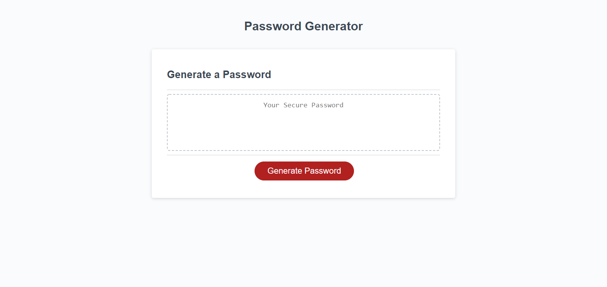

# Password-Generator-SMM

This project is a homework assignment for Rutgers Coding Bootcamp.

## Click link to open in browser.
​
[github pages site] https://imaparadox.github.io/Password-Generator-SMM/

## Description 
Click the button to generate a password. A series of prompts for the password criteria will appear. When prompted for password criteria, please select which criteria to include in the password. Choose a password length between 8 and 128 in addition to selecting any desired character types (lowercase, uppercase, numbers, and special characters). Please note, that you must choose AT LEAST one character type. Finally, when all prompts are selected, a random password will be generated on the web page.

## Notes
This is definitely a challenging project, but I do understand the logic behind it.

## Licenses
N/A

## Acknowledgments for advice and assistance:
N/A